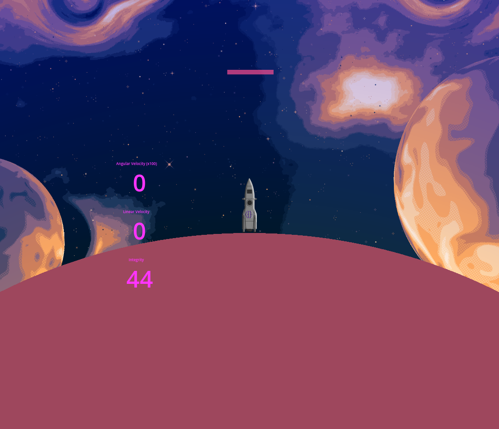

# GodotRocketLanding (GRL)
A simple programmable rocket landing environment



## Lore

In 2147, Earth’s orbital elevators collapsed during a solar storm, severing all high-bandwidth connections to Mars. With a fleet of 1,000 automated rockets en route, each carrying critical resources, manual control from Earth became impossible. Only a narrow data channel remains, just enough to send one final program. You must design a landing algorithm capable of autonomously guiding every rocket through Mars atmosphere, without a single mistake. **Failure isn’t an option. One mistake, and years of progress would crash and burn.**

## Usage

### Python usage
```bash
# in your virtual env
pip install -e .          # websockets, gymnasium, numpy
pip install -e .[train]   # + torch, tqdm, tensorboard (PPO example)

python python/simple_landing.py
# Or 
python python/batch_simple_landing.py
```

### Gymnasium usage
```python
import gymnasium as gym
import grl  # registers GRL/Landing-v0

env = gym.make("GRL/Landing-v0", level_name="random_level_easy")  # headless game launched for you
obs, info = env.reset(seed=42)
obs, reward, terminated, truncated, info = env.step(env.action_space.sample())
env.close()
```
The binary is looked up in `$GRL_BINARY`, the repo root, then the current directory. Subclass `grl.GRLEnv`
(override `get_reward`, `early_stop`, `decode_action`) for custom rewards or actions. The scripts in
`python/` still work and import through `python/utils.py`.

### Launch config (camera zoom, ...)
The camera starts fully zoomed out (x0.40) and zooms with the mouse wheel in flight or the menu slider
(range x0.40 to x2.00). To set it from Python when the game is launched, pass a config, either a dict or a
path to an INI file (Godot `ConfigFile`), which is handed to the game with `--config`:
```python
env = gym.make("GRL/Landing-v0", show_window=True, config={"camera": {"zoom": 0.5}})
# or GRL(config="my_settings.cfg"), with my_settings.cfg containing:
# [camera]
# zoom=0.5
```
The same file works when starting the game by hand: `GRL.exe --config my_settings.cfg`.

### RL frameworks
`GRLEnv` is a standard Gymnasium env, so any Gymnasium-compatible library works. Each example below was run
end to end (short budgets) and launches one headless game per parallel env:

| Framework | Example | Install |
|---|---|---|
| Stable-Baselines3 | `examples/sb3_ppo.py` | `pip install -e .[sb3]` |
| Ray RLlib | `examples/rllib_ppo.py` | `pip install -e .[rllib]` |
| skrl | `examples/skrl_ppo.py` | `pip install -e .[skrl]` |
| Tianshou (2.x) | `examples/tianshou_ppo.py` | `pip install -e .[tianshou]` |
| TorchRL | `examples/torchrl_ppo.py` | `pip install -e .[torchrl]` |
| CleanRL / plain Gymnasium | `examples/gymnasium_cleanrl.py`, `python/simple_ppo.py` | `pip install -e .[train]` |

Env contract: observation `Box(11,)` float32 (includes `landing_pad_distance`, `legs_extension`); action `Box(4,)` in `[-1, 1]`: three thrusters mapped to `(a+1)/2` plus a landing-legs command (`> 0` deploys)
(or `Discrete(2)` with `discrete_actions=True`); `info` has the full state plus `game_state`
(`running`/`victory`/`crash`) and `is_success` on every step; `render_mode="human"` shows the game window;
`port=None` (default) picks a free port. Sample Factory is not covered (no Windows support).

### Tests
```bash
pip install -e . pytest && pytest   # client tests run against a fake server, no game binary needed
```

### Rocket control
3 thrusters and the landing legs (keyboard: arrows for thrust, `G` toggles the legs)
```python
{
    "main_thrust"     : float(0-1),
    "rcs_left_thrust" : float(0-1),
    "rcs_right_thrust": float(0-1),
    "legs"            : float(0-1),  # optional, latched: >= 0.5 deploys, < 0.5 retracts
}
```
To win, touch down on the landing pad with the legs deployed and stay still (< 2 px/s) for 0.5 s.
The legs are spring struts: they soften the touchdown, but when deployed the thrusters lose efficiency
(main engine -15 %, RCS -40 %, so steering and rotating is harder). Gravity and the fall are unaffected.

### Rocket State
Vectors are `[x, y]` lists. When an episode ends, the last state also contains `game_state` (`"victory"` or `"crash"`).
```python
{
    'position': [x, y],              # Rocket position
    'linear_velocity': [x, y],       # Rocket linear velocity in pixels per second
    'angular_velocity': float,       # Rocket rotation speed in radians per second
    'rotation': float(-pi - pi),     # Rocket's rotation in radians
    'num_frame_computed': int,       # Number of frame since start
    'rocket_integrity': float(0-1),  # Integrity of the rocket, at 0.05, BOOOOOM...
    'propellant': float,             # Propellant left
    'temperature': float,            # Rocket's temperature, at somepoint it will melt
    'mass': float,                   # The total mass of the rocket, change according to propellant left.
    'left_leg_contact': bool,        # Rocket left  leg on ground ?
    'right_leg_contact': bool,       # Rocket right leg on ground ?
    'wind_force': float,             # Wind strength
    'wind_direction': [x, y],        # Wind direction
    'planet_radius': float,
    'planet_atmosphere_size': float,
    'planet_mass': float,
    'planet_position': [x, y],
    'landing_pad_position': [x, y],  # random per level load (seeded), victory = safe touchdown on it
    'landing_pad_width': float,
    'landing_pad_distance': float,   # signed surface distance to the pad centre, > 0 = pad to the right
    'on_landing_pad': bool,
    'legs_deployed': bool,           # commanded leg state
    'legs_extension': float(0-1),    # deploy/retract animation progress (0.8 s)
    'settle_time': float,            # s spent settled on the pad (victory at 0.5 s)
}
```

See [docs/protocol.md](docs/protocol.md) for the wire protocol (seeding, frame skip, terminal states).

## Roadmap

- [X] Rocket control and state
- [X] Python controllable
    - [X] Control by overriding `GRL.process` method
    - [X] run in batch mode
- [X] Thruster and RCS
- [X] Propellant System
    - [X] Propellant Tank
    - [X] Mass updating
- [X] Wind System
- [X] Planet as sphere and dynamic gravity
- [X] Support Big Number
- [X] Atmospheric system
    - [X] Visual Atmosphere (Shader)
    - [X] Atmospheric damage
        - [X] Hull stress damage
        - [X] Thermal damage
    - [X] Atmospheric drag
        - $F_d​=\frac{1}{2} * ​C_d * ρ * v^2 * A$
            - C_d​: Drag coefficient (depends on the rocket's shape and surface roughness)
            - ρ: Air density (varies with altitude)
            - v: Rocket velocity relative to the air
            - A: Cross-sectional area of the rocket
        - $ρ=ρ_0 * ​exp(−\frac{h}{H​})$
- [ ] Add an emergency ejection with parachute
- [X] Levels
    - Level 1
    - Level 2
    - Level 3
    - Level 4
    - Random
      - [X] easy
      - [X] moderate
      - [X] hard

## Thanks
- [The1Muneeb](https://deep-fold.itch.io/space-background-generator), for space background generator.
- [Simon Celeste](https://github.com/Celeste-VANDAMME), for the design of the rocket !
- [Kenney.nl](https://www.kenney.nl/), for the particules sprite
- [Sinestesia Studio](https://itch.io/profile/sinestesia), for explosion animation
- [ChronoDK](https://github.com/ChronoDK/GodotBigNumberClass), for Big Number class
- [chatGPT](https://chatgpt.com/), for wise advice and tips