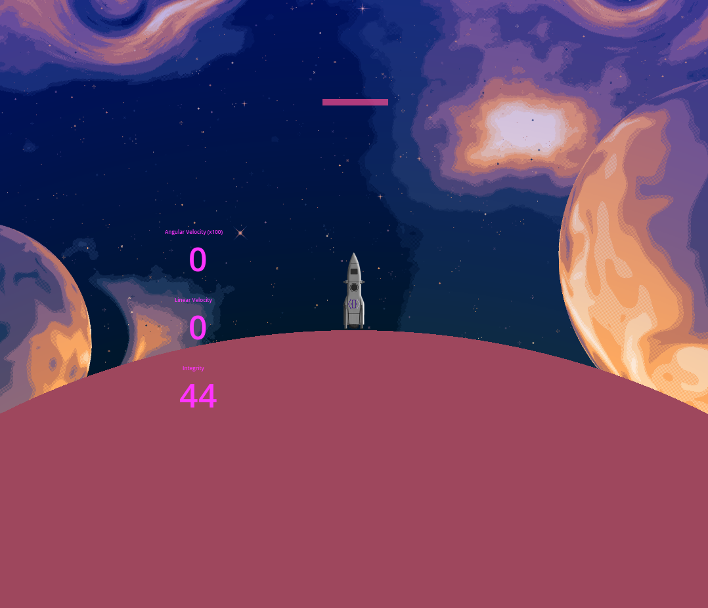

# GodotRocketLanding (GRL)
A simple programmable rocket landing environment



## Lore

In 2147, Earth’s orbital elevators collapsed during a solar storm, severing all high-bandwidth connections to Mars. With a fleet of 1,000 automated rockets en route, each carrying critical resources, manual control from Earth became impossible. Only a narrow data channel remains, just enough to send one final program. You must design a landing algorithm capable of autonomously guiding every rocket through Mars atmosphere, without a single mistake. **Failure isn’t an option. One mistake, and years of progress would crash and burn.**

## Usage

### Python usage
```bash
# in your virtual env
pip install websockets

python python/simple_landing.py
# Or 
python python/batch_simple_landing.py
```

### Rocket control
You can control only 3 Thrusters
```python
{
    "main_thrust"     : float(0-1),
    "rcs_left_thrust" : float(0-1),
    "rcs_right_thrust": float(0-1)
}
```

### Rocket State
```python
{
    'position': tuple(x,y),
    'velocity': tuple(x,y),
    'rotation': float(-pi - pi),
    'num_frame_computed': int,
    'rocket_integrity': float(0-1),
    'propellant': int,
    'wind': tuple(x,y),
}
```

## Roadmap

- [X] Rocket control and state
- [X] Python controllable
    - [X] Control by overriding `GRL.process` method
    - [X] run in batch mode
- [X] Thruster and RCS
- [X] Propellant System
    - [X] Propellant Tank
    - [X] Mass updating
- [X] Wind System
- [X] Planet as sphere and dynamic gravity
- [X] Support Big Number
- [X] Atmospheric system
    - [X] Visual Atmosphere (Shader)
    - [X] Atmospheric damage
        - [X] Hull stress damage
        - [X] Thermal damage
    - [X] Atmospheric drag
        - $F_d​=\frac{1}{2} * ​C_d * ρ * v^2 * A$
            - C_d​: Drag coefficient (depends on the rocket's shape and surface roughness)
            - ρ: Air density (varies with altitude)
            - v: Rocket velocity relative to the air
            - A: Cross-sectional area of the rocket
        - $ρ=ρ_0 * ​exp(−\frac{h}{H​})$
- [ ] Levels
    - Level 1
    - Level 2
    - Level 3
    - Level 4
    - Need more

## Thanks
- [The1Muneeb](https://deep-fold.itch.io/space-background-generator), for space background generator.
- [Simon Celeste](https://github.com/Celeste-VANDAMME), for the design of the rocket !
- [Kenney.nl](https://www.kenney.nl/), for the particules sprite
- [Sinestesia Studio](https://itch.io/profile/sinestesia), for explosion animation
- [ChronoDK](https://github.com/ChronoDK/GodotBigNumberClass), for Big Number class
- [chatGPT](https://chatgpt.com/), for wise advice and tips